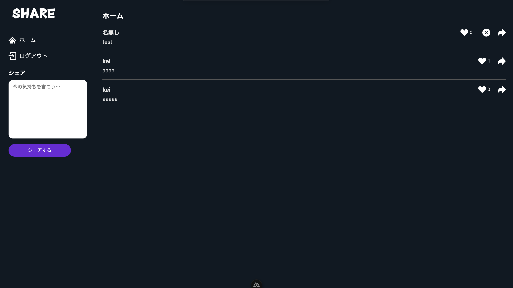
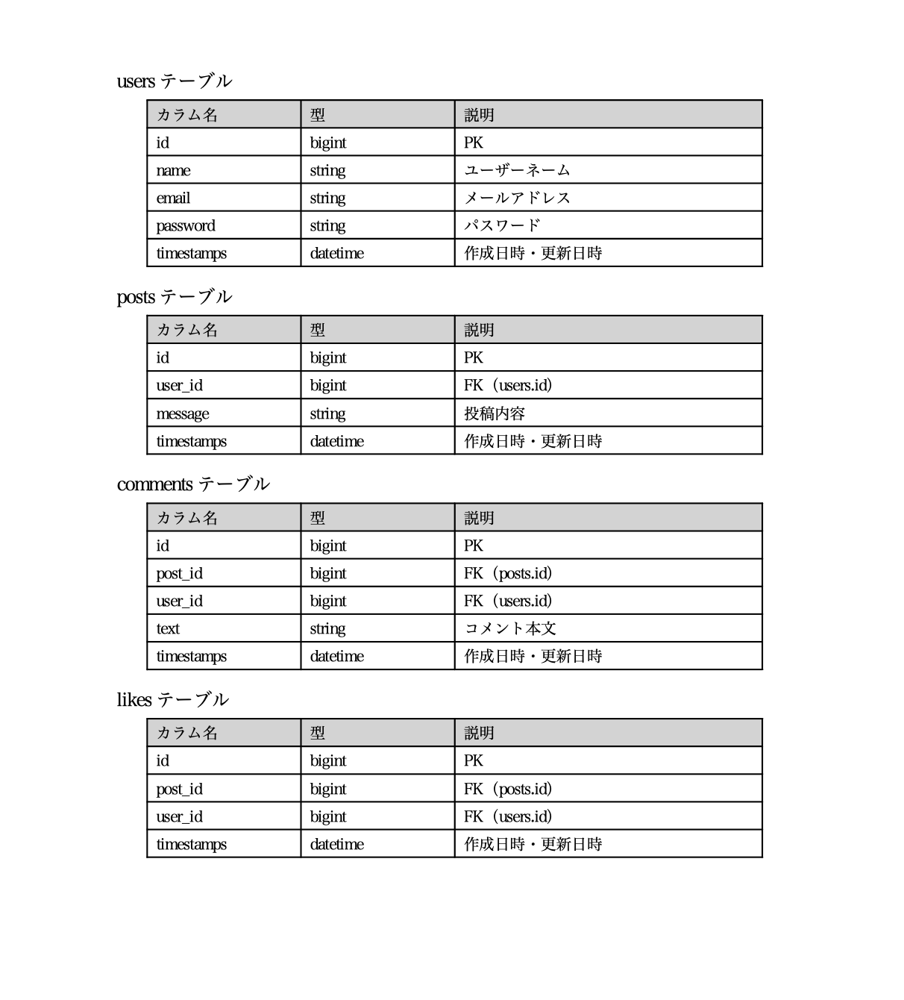
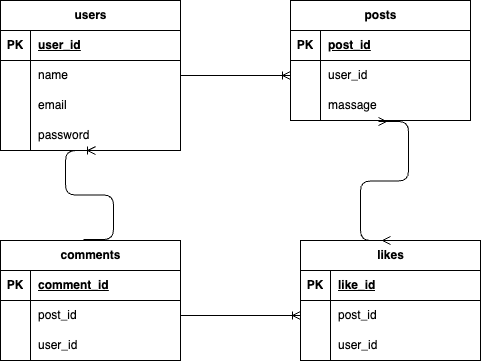

# SHARE（Twitter風SNSアプリ）

## ■ アプリ概要画像


---

## ■ 作成した目的
本アプリケーションは、**Nuxt.js（フロント）× Laravel（API）× Firebase Auth（認証）× Docker（環境構築）** を通して、実践的な学習をすることを目的に作成しました。

---

## ■ アプリケーションURL
http://localhost:3000/

---

## ■ 関連リポジトリ
https://github.com/yoshizawakei/chirp-social-app.git

---

## ■ 機能一覧

### ● 認証
- 新規登録（ユーザーネーム／メール／パスワード）
- ログイン
- ログアウト
- 認証状態保持（Firebase）

### ● 投稿機能
- 投稿一覧表示
- 投稿作成
- 投稿削除（本人のみ）
- 詳細ページへ遷移

### ● いいね機能
- いいね追加
- いいね解除
- いいね数の更新

### ● コメント機能
- コメント一覧表示
- コメント投稿
- コメント編集（本人のみ）
- コメント削除（本人のみ）

### ● UI コンポーネント
- TheHeader（全ページ共通ヘッダー）
- TheSidebar（サイドメニュー）
- Message（投稿一覧表示）
- ConfirmModal（削除・編集の確認モーダル）

---

## ■ 使用技術（実行環境）

### フロントエンド
- Nuxt.js 4.2.0
- Vue.js 3.5.22（Composition API）
- Pinia 3.0.3
- Firebase Authentication 12.5.0
- Vite 5系

### バックエンド
- Laravel 12.38.1
- PHP 8.2.29
- Laravel Sanctum
- MySQL 8.0.44

### 環境構築
- Docker / Docker Compose
  - nginx
  - php-fpm
  - node
  - mysql

---

## ■ テーブル設計

### users テーブル
| カラム名 | 型 | 説明 |
|---------|------|------|
| id | bigint | PK |
| name | string | ユーザーネーム |
| email | string | メールアドレス |
| password | string | パスワード |
| timestamps | - | 作成日時など |

### posts テーブル
| カラム名 | 型 | 説明 |
|---------|------|------|
| id | bigint | PK |
| user_id | bigint | FK（users.id） |
| message | string | 投稿内容 |
| timestamps | - | 作成日時など |

### comments テーブル
| カラム名 | 型 | 説明 |
|----------|------|------|
| id | bigint | PK |
| post_id | bigint | FK（posts.id） |
| user_id | bigint | FK（users.id） |
| text | string | コメント本文 |
| timestamps | - | 作成日時 |

### likes テーブル
| カラム名 | 型 | 説明 |
|----------|------|------|
| id | bigint | PK |
| post_id | bigint | FK |
| user_id | bigint | FK |
| timestamps | - | 作成日時 |

---

## ■ テーブル設計（画像）


---

## ■ ER図（画像）


---

## ■ 環境構築（ローカル）

### 1. リポジトリをクローン
```
git clone https://github.com/yoshizawakei/chirp-social-app.git
```

---

### 2. Firebase Consoleの設定
```
Firebase Console（https://console.firebase.google.com/） にアクセスし、新しいプロジェクトを作成します。
左メニューにある[プロジェクトの設定]（歯車アイコン） → サービスアカウントの「Firebase Admin SDK」タブを開き、
「新しい秘密鍵を生成」をクリック。
.jsonをダウンロードしたら、ファイル名をfirebase_credentialsに変更し、ルートディレクトリ直下に保存
```

---

### 3. Docker コンテナ起動
```
docker-compose up -d --build
```
---

### 4. フロントエンド（Nuxt）
```
docker-compose exec frontend sh
npm install
cp .env.example .env
```

---

### 5. バックエンド（Laravel）
```
docker-compose exec backend bash
composer install
cp .env.example .env
php artisan key:generate
php artisan migrate --seed
```

```
`.env`内に MySQL等の接続設定を記述します。
xxxxの部分は、docker-compose.ymlを参照。

DB_CONNECTION=mysql
DB_HOST=mysql_db
DB_PORT=3306
DB_DATABASE=xxxx
DB_USERNAME=xxxx
DB_PASSWORD=xxxx

SANCTUM_STATEFUL_DOMAINS=localhost,localhost:3000
CORS_ALLOWED_ORIGINS=http://localhost:3000

FIREBASE_CREDENTIALS=/var/www/html/firebase_credentials.json
```

---

### 6. Firebase の環境変数設定（Nuxt）
backendディレクトリ直下に`.env`を作成し、以下の内容を記述します。

```
NUXT_PUBLIC_API_URL=http://localhost/api

NUXT_PUBLIC_FIREBASE_API_KEY=xxxx
NUXT_PUBLIC_FIREBASE_AUTH_DOMAIN=xxxx
NUXT_PUBLIC_FIREBASE_PROJECT_ID=xxxx
NUXT_PUBLIC_FIREBASE_APP_ID=xxxx
```

※Firebase Console にアクセスし、新しいプロジェクトを作成します。
プロジェクト内で Authentication を有効にします。
プロジェクト設定から、ウェブアプリ を追加し、firebaseConfig オブジェクトを取得します。
取得したオブジェクトをxxxの部分に入力します。

---

### 7. コンテナの再起動
全ての設定が完了したら、一度コンテナを削除し、再度立ち上げる。
```
docker-compose down
docker-compose up -d --build
```

---

## ■ テストユーザー（新規登録からご自身で作成してください。）
```
ユーザー名：test1
メール：test1@example.com
パスワード：password

```

```
ユーザー名：test2ユーザー名
メール：test2@example.com
パスワード：password

```

---

# 以上です。
