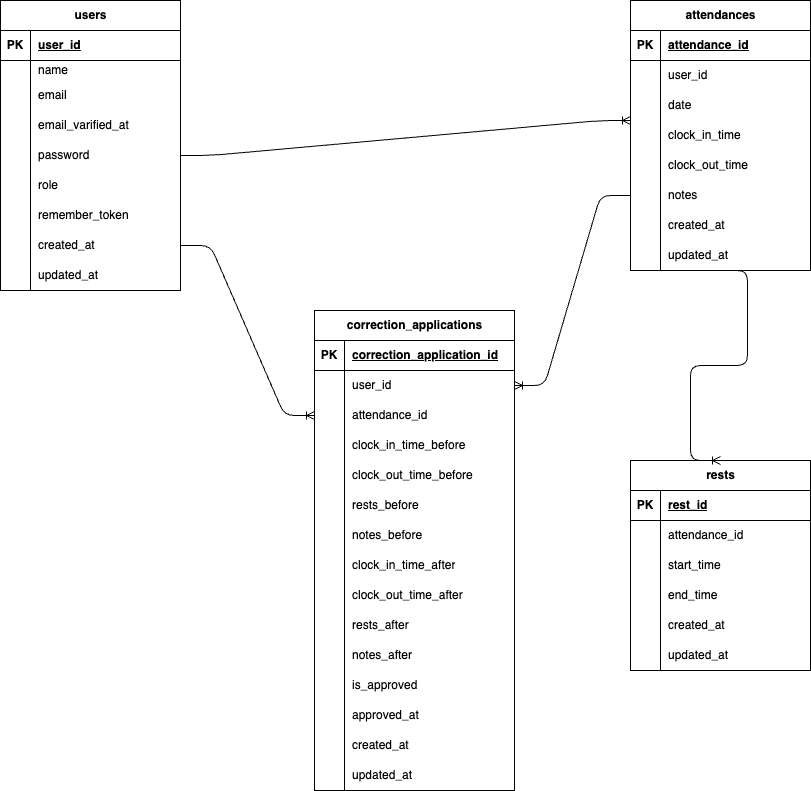

# coachtech 勤怠管理アプリ

## 環境構築
Dockerビルト
1. git clone git@github.com:yoshizawakei/test-project2.git
2. docker-compose up -d --build
※MySQLは、OSによって起動しない場合があるので、それぞれのPCに合わせてdocker-compose.ymlファイルを編集してください。

Laravel環境構築
1. docker-compose exec php bash
2. composer install
3. .env.exampleファイルから.envを作成し、環境変数を変更(DB,MAIL,STRIPE)
4. php artisan key:generate
5. php artisan migrate
6. php artisan db:seed

## 使用技術(実行環境)
- PHP 7.4.33
- Laravel 8.83.29
- MySQL 15.1

## ER図


## URL
- 開発環境：http://localhost/
- phpMyAdmin：http://localhost:8080/

## メール認証
mailtrapというツールを使用しています。<br>
以下のリンクから会員登録をしてください。　<br>
https://mailtrap.io/

メールボックスのIntegrationsから 「laravel 7.x and 8.x」を選択し、　<br>
.envファイルのMAIL_MAILERからMAIL_ENCRYPTIONまでの項目をコピー＆ペーストしてください。　<br>
MAIL_FROM_ADDRESSは任意のメールアドレスを入力してください。　

## テーブル仕様
### usersテーブル
| カラム名 | 型 | primary key | unique key | not null | foreign key |
| --- | --- | --- | --- | --- | --- |
| id | bigint | ◯ |  | ◯ |  |
| name | varchar(255) |  |  | ◯ |  |
| email | varchar(255) |  | ◯ | ◯ |  |
| email_verified_at | timestamp |  |  |  |  |
| password | varchar(255) |  |  | ◯ |  |
| role | tinyint |  |  | ◯ |  |
| remember_token | varchar(100) |  |  |  |  |
| created_at | timestamp |  |  | ◯ |  |
| updated_at | timestamp |  |  | ◯ |  |

### attendancesテーブル
| カラム名 | 型 | primary key | unique key | not null | foreign key |
| --- | --- | --- | --- | --- | --- |
| id | bigint | ◯ |  | ◯ |  |
| user_id | bigint |  | ◯ | ◯ | users(id) |
| date | date |  | ◯ | ◯ |  |
| clock_in_time | time |  |  |  |  |
| clock_out_time | time |  |  |  |  |
| notes | text |  |  |  |  |
| created_at | timestamp |  |  | ◯ |  |
| updated_at | timestamp |  |  | ◯ |  |

### restsテーブル
| カラム名 | 型 | primary key | unique key | not null | foreign key |
| --- | --- | --- | --- | --- | --- |
| id | bigint | ◯ |  | ◯ |  |
| attendance_id | bigint |  |  | ◯ | attendances(id) |
| start_time | time |  |  |  |  |
| end_time | time |  |  |  |  |
| created_at | timestamp |  |  | ◯ |  |
| updated_at | timestamp |  |  | ◯ |  |

### correction_applicationsテーブル
| カラム名 | 型 | primary key | unique key | not null | foreign key |
| --- | --- | --- | --- | --- | --- |
| id | bigint | ◯ |  | ◯ |  |
| user_id | bigint |  |  | ◯ | users(id) |
| attendance_id | bigint |  |  | ◯ | attendances(id) |
| clock_in_time_before | time |  |  |  |  |
| clock_out_time_before | time |  |  |  |  |
| rests_before | json |  |  |  |  |
| notes_before | text |  |  |  |  |
| clock_in_time_after | time |  |  |  |  |
| clock_out_time_after | time |  |  |  |  |
| rests_after | json |  |  |  |  |
| notes_after | text |  |  |  |  |
| is_approved | tinyint |  |  |  |  |
| approved_at | timestamp |  |  |  |  |
| created_at | timestamp |  |  | ◯ |  |
| updated_at | timestamp |  |  | ◯ |  |

## テストアカウント
name: 一般ユーザ1
email: test@example.com
password: password
-------------------------
name: 一般ユーザ2
email: test@example.nz
password: password
-------------------------
name: 管理者
email: test@example.co.jp
password: password
-------------------------

## PHPUnitを利用したテストに関して
以下のコマンド:
```
//テスト用データベースの作成
docker-compose exec mysql bash
mysql -u root -p
//パスワードはrootと入力
create database test_database;

docker-compose exec php bash
php artisan migrate:fresh --env=testing
./vendor/bin/phpunit
```
